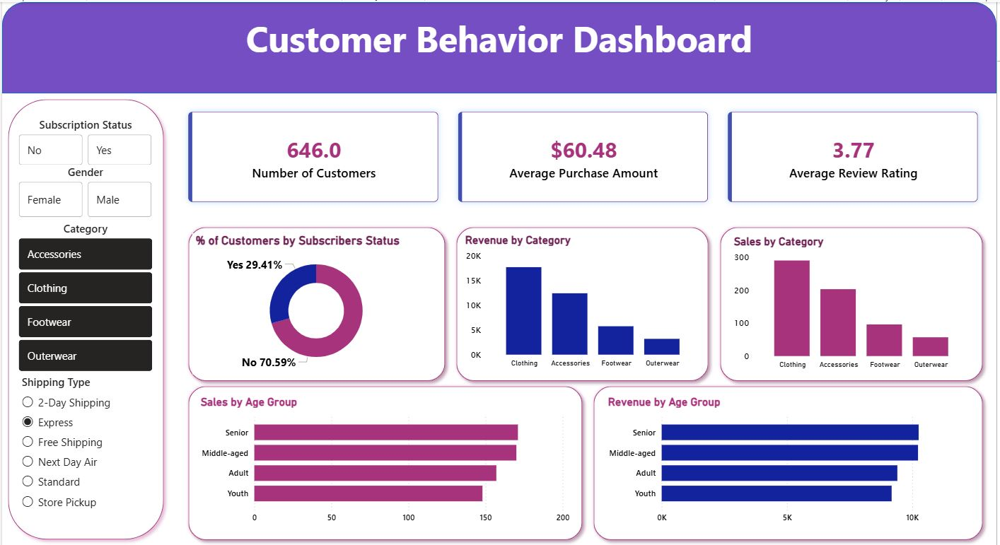

# 📊 Customer Behavior Analysis

This project is an end-to-end Data Analytics case study focused on analyzing customer shopping behavior using Python, SQL, and Power BI. It follows a real-world business workflow where raw customer data is cleaned, transformed, analyzed, and visualized to generate actionable business insights.

The main objective of this project is to understand customer purchase patterns, revenue trends, subscription behavior, discount impact, product performance, and customer segmentation to support better business decision-making.

## 🛠 Tools & Technologies Used

- Python (Pandas, Data Cleaning, Data Transformation)
- SQL (Data Querying, Aggregations, Business Problem Solving)
- Power BI (Dashboard Creation, KPI Tracking, Interactive Visualizations)
- MySQL (Database Storage and Query Execution)
- Excel / CSV (Raw Dataset Handling)

## 🔄 Project Workflow

### 1. Data Cleaning using Python

- Handling missing values
- Fixing data types
- Creating new calculated columns
- Customer segmentation
- Feature engineering for better analysis

### 2. SQL Business Analysis

Solved multiple business-driven analytical questions such as:

- Revenue comparison by gender
- Top-rated products analysis
- Discount vs purchase behavior
- Subscriber vs non-subscriber spending analysis
- Repeat buyer behavior
- Product category performance
- Age-group revenue contribution
- Customer loyalty segmentation

### 3. Power BI Dashboard

Created an interactive dashboard to visualize:

- Revenue KPIs
- Customer segments
- Product performance
- Subscription insights
- Discount effectiveness
- Purchase trends and patterns

## 📈 Key Business Insights

- Identified high-value customer segments
- Found top revenue-generating products
- Analyzed customer loyalty patterns
- Measured subscription impact on revenue
- Evaluated discount effectiveness on spending behavior
- Compared customer purchasing trends across categories

## 🎯 Project Outcome

This project demonstrates how raw customer transaction data can be transformed into business intelligence using a complete analytics workflow. It showcases practical skills required for real-world Data Analyst roles and reflects how companies use data for strategic decision-making.

## 📸 Dashboard Preview

## 👨‍💻 Author

Udaydeep  
Data Analytics | Python | SQL | Power BI
